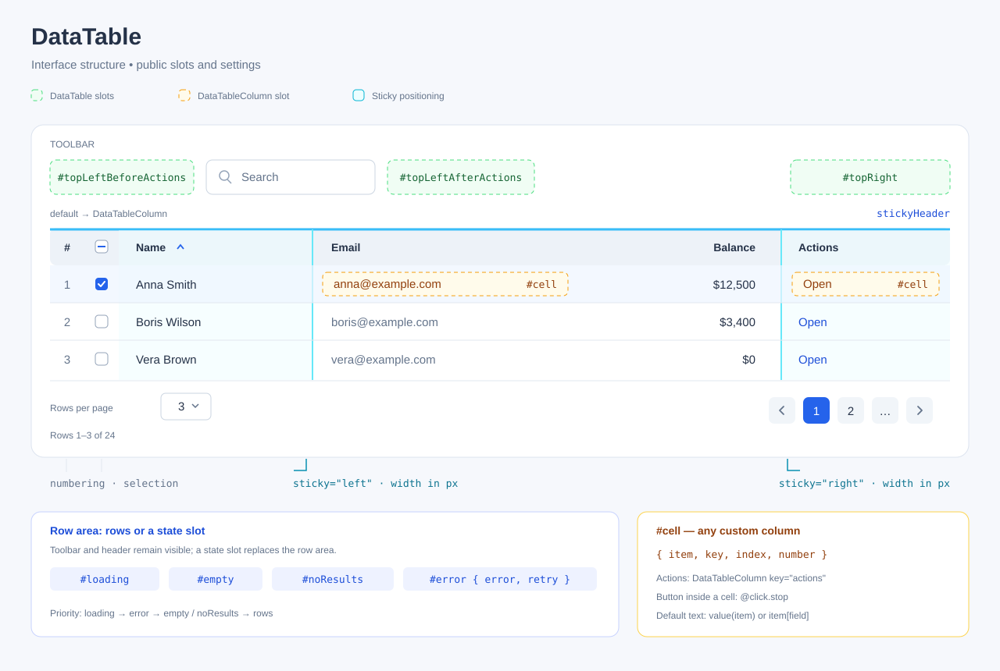

# Таблица `DataTable`

`DataTable` управляет источником записей, поиском, сортировкой, пагинацией,
выбором строк и состояниями загрузки. Колонки объявляются внутри таблицы через
`DataTableColumn`. Прямой импорт компонента не требует установки плагина.

[Публичный контракт](api-v2.md) · [Колонки](data-table-column.md) ·
[Типизация](typed-table.md) · [Оформление](customization.md)

## Структура интерфейса



Зелёным обозначены слоты верхней панели, оранжевым — слот `cell` колонки.
Нумерация и выбор создаются самой таблицей. Действия записи оформляются
обычной колонкой со слотом `cell`; отдельного слота действий нет.

Слоты состояний заменяют область строк. Заголовок и панели сохраняются.
Поиск скрывается при `search=false`; пустая верхняя панель без пользовательских
слотов не создаётся.

## Параметры

| Параметр                  | Тип                         | Значение по умолчанию и ограничения                                      |
| ------------------------- | --------------------------- | ------------------------------------------------------------------------ |
| `messages`                | `Partial<TableMessages>`    | конфигурация приложения / `defaultMessages`                              |
| `source`                  | `local` или `remote`        | `'remote'`                                                               |
| `items`                   | `readonly RowItem[]`        | `[]`; используется только для `local`                                    |
| `url`                     | `string`                    | `undefined`; непустой `URL` обязателен для `remote`                      |
| `filter`                  | `TableFilter`               | `{}`; `JSON`-совместимые значения, только для `remote`                   |
| `requestAdapter`          | `RequestAdapter`            | конфигурация приложения / стандартный адаптер                            |
| `responseAdapter`         | `ResponseAdapter<T>`        | конфигурация приложения / стандартный адаптер                            |
| `pagination`              | `boolean`                   | `true`                                                                   |
| `page`                    | `number`                    | `undefined`; управляемый режим                                           |
| `defaultPage`             | `number`                    | `1`                                                                      |
| `rowsPerPageCount`        | `number`                    | `undefined`; управляемый режим                                           |
| `defaultRowsPerPageCount` | `number`                    | `25`                                                                     |
| `rowsPerPageOptions`      | `readonly number[]`         | `[10, 25, 50, 100]`                                                      |
| `search`                  | `boolean`                   | `true`                                                                   |
| `searchQuery`             | `string`                    | `undefined`; управляемый режим                                           |
| `defaultSearchQuery`      | `string`                    | `''`                                                                     |
| `sort`                    | `Sort`                      | `undefined`; управляемый режим, `null` означает отсутствие сортировки    |
| `defaultSort`             | `Sort`                      | `null`                                                                   |
| `rowKey`                  | `RowKeySelector<RowItem>`   | обязательный: имя поля записи или функция получения ключа                |
| `selection`               | `boolean`                   | `false`                                                                  |
| `selectedRowKeys`         | `readonly RowKey[]`         | `undefined`; управляемый режим                                           |
| `defaultSelectedRowKeys`  | `readonly RowKey[]`         | `[]`                                                                     |
| `allowSelectAll`          | `boolean`                   | `true`                                                                   |
| `selectionLimit`          | `number` или `null`         | `1000`; 0 запрещает выбор, `null` снимает лимит                          |
| `rowsClickable`           | `boolean`                   | `false`                                                                  |
| `selectOnRowClick`        | `boolean`                   | `false`; требует `rowsClickable` и `selection`                           |
| `showPageDetails`         | `boolean`                   | `true`                                                                   |
| `scrollX`                 | `boolean`                   | `false`                                                                  |
| `stickyHeader`            | `boolean`                   | `false`; заголовок закрепляется относительно ближайшей области прокрутки |
| `verticalBorders`         | `boolean`                   | `false`; заголовок и ячейки                                              |
| `striped`                 | `boolean`                   | `false`                                                                  |
| `density`                 | `compact` или `comfortable` | `comfortable`; плотность ячеек и контролов                               |
| `numbering`               | `boolean`                   | `false`                                                                  |

Управляемые параметры по умолчанию равны `undefined`. Это позволяет отличить
автономный режим от значения, заданного родителем. Если переданы оба параметра
пары, например `page` и `defaultPage`, приоритет имеет управляемый `page`.

### Источник данных

В режиме `source="local"` используется `items`. Исходный массив и записи
не изменяются. Поиск работает только по колонкам с `searchable=true`.
Параметр `filter` в локальном режиме не применяется.

В режиме `source="remote"` обязателен непустой `url`. Запрос и ответ могут
преобразовываться через адаптеры. При пагинации сервер возвращает текущую
страницу; без пагинации — весь отфильтрованный результат.
Подробные правила приведены в [контракте удалённых данных](api-v2/remote.md).

### Пагинация и поиск

При `pagination=false` эффективная страница равна `1`, элементы пагинации
и размера страницы скрыты. Локальная таблица показывает весь отфильтрованный набор.
`showPageDetails` независимо управляет текстом диапазона.

При `search=false` поле и слот поиска скрыты, эффективный запрос пуст.
Начальные значения читаются один раз; управляемые значения применяются при
обновлении родителем. Правила нормализации описаны в [руководстве по состоянию](api-v2/state.md).

## Слоты

| Слот                   | Передаваемые данные            | Назначение                                      |
| ---------------------- | ------------------------------ | ----------------------------------------------- |
| `default`              | `Нет`                          | Объявления колонок, включая `v-for` и `v-if`    |
| `topLeftBeforeActions` | `ToolbarSlotProps`             | Содержимое перед поиском                        |
| `topLeftAfterActions`  | `ToolbarSlotProps`             | Содержимое после поиска                         |
| `topRight`             | `ToolbarSlotProps`             | Правая часть верхней панели                     |
| `search`               | `{ value, setValue }`          | Замена поиска при `search=true`                 |
| `rowsPerPage`          | `{ value, options, setValue }` | Замена размера страницы при `pagination=true`   |
| `pagination`           | `{ page, pageCount, setPage }` | Замена пагинации при `pagination=true`          |
| `empty`                | `Нет`                          | Источник не содержит записей                    |
| `noResults`            | `Нет`                          | Источник содержит записи, но `filtered=0`       |
| `loading`              | `Нет`                          | Замена стандартного отображения загрузки        |
| `error`                | `{ error, retry }`             | Замена сообщения об ошибке и повторного запроса |

### Контекст верхней панели

`ToolbarSlotProps` содержит:

- `selectedCount: number` — количество выбранных видимых записей.
- `loading: boolean` — выполняется ли запрос.
- `clearSelection: () => void` — очистка выбора с учётом управляемого режима.
- `reload: () => Promise<void>` — принудительное обновление данных.

Существующие слоты без параметров продолжают работать. Кнопки и другие
пользовательские элементы оформляются приложением.

### Контекст элементов управления

`setValue` поиска принимает строку. `setValue` размера страницы принимает число;
`options` содержит нормализованный список размеров. `setPage` принимает номер
страницы. Обработчики сохраняют обычные правила нормализации и событий таблицы.
`pageCount` равен `0`, если результатов нет.

Имена полей объекта слота записываются в `camelCase`, например `setValue`.
Пользовательский слот полностью заменяет соответствующий встроенный элемент.
Пример и `CSS`-переменные находятся в [руководстве по оформлению](customization.md).

## Состояния данных

| Состояние                | Когда отображается                                           | Стандартное содержимое                                            |
| ------------------------ | ------------------------------------------------------------ | ----------------------------------------------------------------- |
| `loading`                | `Первая загрузка` или `задан пользовательский слот загрузки` | Сообщение о загрузке                                              |
| Строки во время загрузки | Уже есть записи и слот `loading` отсутствует                 | Прежняя геометрия строк, полосы загрузки вместо содержимого ячеек |
| `error`                  | `Последний актуальный запрос завершился ошибкой`             | Сообщение и кнопка повторного запроса                             |
| `noResults`              | `total>0, filtered=0, записей нет`                           | Сообщение и очистка активного поиска                              |
| `empty`                  | `Записей в источнике нет`                                    | Сообщение об отсутствии данных                                    |
| Обычные строки           | Есть записи, нет загрузки и ошибки                           | Содержимое ячеек                                                  |

Приоритет проверки: загрузка → ошибка → строки → отсутствие результатов
или пустой источник. При наличии записей стандартная загрузка сохраняет строки,
но скрывает их содержимое. Слот `loading` заменяет область строк целиком.

Во время запроса выбор и действие по клику на строку недоступны. Поиск,
сортировка и пагинация могут инициировать заменяющий запрос. При ошибке прежние
строки скрываются. Слот `error` получает ошибку типа `unknown` и `retry`, который
вызывает `reload()`.

Кнопка очистки в стандартном `noResults` появляется только при включённом поиске
и непустом запросе. Подпись берётся из `messages.clearSearch`. Действие использует
обычный обработчик поиска и сохраняет управляемый режим. Слот `noResults`
заменяет сообщение и кнопку целиком.

## События

| Событие                   | Данные события                                                     |
| ------------------------- | ------------------------------------------------------------------ |
| `update:page`             | `number`                                                           |
| `update:rowsPerPageCount` | `number`                                                           |
| `update:searchQuery`      | `string`                                                           |
| `update:sort`             | `Sort`                                                             |
| `update:selectedRowKeys`  | `RowKey[]`                                                         |
| `selectionChange`         | `{ keys: RowKey[], items: T[] }`                                   |
| `rowClick`                | `{ key: RowKey, item: T }`                                         |
| `requestStart`            | `{ requestId: number, request: BuiltRequest }`                     |
| `requestSuccess`          | `{ requestId: number, data: TableData<T> }`                        |
| `requestError`            | `{ requestId: number, error: unknown }`                            |
| `requestEnd`              | `{ requestId: number, status: 'success' \| 'error' \| 'aborted' }` |

Имена событий в `TypeScript` имеют вид `rowClick` и `selectionChange`.
В шаблонах используются дефисы: `@row-click`, `@selection-change`.
Модели связываются через `v-model:page`, `v-model:search-query` и аналогичные имена.

`rowClick` отправляется только при `rowsClickable=true`. Если одновременно
включён `selectOnRowClick`, после события запрашивается переключение выбора.
Флажок не вызывает `rowClick`.

Для кнопки или ссылки внутри `cell` используется `@click.stop`, если действие
не должно запускать клик строки. Таблица не определяет это автоматически
по типу `DOM`-элемента.

`selectionChange` содержит эффективные выбранные ключи и соответствующие записи.
События удалённых запросов отсутствуют в локальном режиме. Их последовательность
и отмена описаны в [контракте запросов](api-v2/remote.md#отмена-и-события).

## Методы экземпляра

| Метод                     | Поведение                                                                                           |
| ------------------------- | --------------------------------------------------------------------------------------------------- |
| `reload(): Promise<void>` | Локально пересчитывает данные; удалённо отменяет задержку и активный запрос и сразу запускает новый |
| `clearSelection(): void`  | Очищает автономный выбор либо отправляет предложение `update:selectedRowKeys` с пустым массивом     |

`reload()` завершается после успеха, ошибки или отмены. Ошибка транспорта
не отклоняет `Promise`: она доступна через состояние и события.
После уничтожения компонента методы ничего не меняют, а `reload()` возвращает
завершённый `Promise`.

## Управляемое состояние и ссылка на компонент

Каждое поле может управляться независимо. Начальное значение модели должно быть
задано до создания таблицы. `sort=null` сохраняет управляемый режим без сортировки;
`undefined` при создании означает автономный режим.

```vue
<script setup lang="ts">
import { ref } from 'vue'
import { DataTable, DataTableColumn, type RowKey, type Sort } from 'vue-datatables-182'
import 'vue-datatables-182/dist/index.css'

const table = ref<InstanceType<typeof DataTable> | null>(null)
const items = [
  { id: 1, name: 'Анна' },
  { id: 2, name: 'Борис' },
]
const page = ref(1)
const perPage = ref(10)
const query = ref('')
const sort = ref<Sort>(null)
const selected = ref<RowKey[]>([])

async function refresh() {
  await table.value?.reload()
}
function clear() {
  table.value?.clearSelection()
}
</script>

<template>
  <button
    type="button"
    @click="refresh"
  >
    Обновить
  </button>
  <button
    type="button"
    @click="clear"
  >
    Снять выбор
  </button>
  <DataTable
    ref="table"
    v-model:page="page"
    v-model:rows-per-page-count="perPage"
    v-model:search-query="query"
    v-model:sort="sort"
    v-model:selected-row-keys="selected"
    :items="items"
    row-key="id"
    selection
    source="local"
  >
    <DataTableColumn
      field="name"
      title="Имя"
      searchable
      sortable
    />
  </DataTable>
</template>
```

После изменения поиска, сортировки или размера страницы эффективная `page`
становится `1`, выбор очищается. При обновлении данных выбранные ключи
согласуются с текущими видимыми строками. Полные правила:
[состояние таблицы](api-v2/state.md).

## Ключи и выбор записей

`rowKey` задаётся прямым именем поля или функцией от записи. Результат — строка
или конечное число. Значения `1` и `'1'` различаются. Повторы, отсутствие ключа,
`NaN` и бесконечность запрещены. Локально проверяется весь массив, удалённо — ответ.

Выбор ограничен текущей страницей. `selectionLimit=0` запрещает выбор,
`null` снимает ограничение. Выбор всех строк берёт первые видимые записи до лимита.
Если лимит меньше страницы, флажок заголовка показывает частичный выбор.

В управляемом режиме родитель подтверждает `update:selectedRowKeys`.
Изменение содержимого записи при прежнем выбранном ключе не создаёт
`selectionChange`. Отключение `selection` очищает выбор.

## Сообщения и локализация

Все стандартные тексты доступны через `messages`. Приоритет: параметр таблицы →
конфигурация приложения → `defaultMessages`. Допустим частичный объект;
`undefined` не удаляет стандартное значение.

Для номера страницы, строки, сортировки и диапазона используются функции.
`pageDetails` получает `start`, `end`, `filtered` и `total`; пустой диапазон — `0–0`.

```vue
<script setup lang="ts">
import { DataTable, DataTableColumn, type TableMessages } from 'vue-datatables-182'
import 'vue-datatables-182/dist/index.css'

const items = [{ id: 1, name: 'Анна' }]
const messages: Partial<TableMessages> = {
  tableLabel: 'Пользователи',
  search: 'Поиск',
  searchPlaceholder: 'Найти пользователя',
  empty: 'Пользователей пока нет',
  noResults: 'По запросу ничего не найдено',
  pageDetails: ({ start, end, filtered }) => `${start}–${end} из ${filtered}`,
}
</script>

<template>
  <DataTable
    :items="items"
    :messages="messages"
    row-key="id"
    source="local"
  >
    <DataTableColumn
      field="name"
      title="Имя"
      searchable
    />
  </DataTable>
</template>
```

Остальные ключи: `clearSearch`, `rowsPerPage`, `pagination`, `firstPage`,
`previousPage`, `nextPage`, `lastPage`, `page`, `sort`, `selectAll`, `selectRow`,
`activateRow`, `numbering`, `selection`, `loading`, `error`, `retry`.
Непереопределённые сообщения остаются русскими. Слоты состояний имеют приоритет
над стандартным текстом.

## Доступность

Структура использует роли `table`, `row`, `rowgroup`, `columnheader` и `cell`.
Кнопки, поля ввода, список размеров и флажки являются нативными элементами.
Подписи задаются через сообщения; при нескольких таблицах `tableLabel`
должен описывать назначение каждой из них.

Сортировка запускается отдельной кнопкой, доступной с клавиатуры.
При `rowsClickable=true` дополнительная кнопка действия строки доступна через
`Tab` и становится видимой при фокусе. Поле поиска меняет цвет границы при фокусе
без `outline`. Снижение движения учитывается через `prefers-reduced-motion`.
Ручные сценарии приведены в [Storybook](storybook.md).

## Ошибки конфигурации и производительность

Непустой `url` обязателен для удалённых данных. Неправильные `rowKey`,
`selectionLimit`, ключи колонок, источники их значений и ширины закрепления
приводят к ошибке конфигурации. Недопустимые значения активной локальной
сортировки также вызывают `Error`.

Ошибки сети, `JSON`, адаптеров и удалённых ключей отображаются через `error`,
`requestError` и `requestEnd` со статусом `error`.

Виртуализация не используется. Ориентир для измерений локальной таблицы — до
`10 000` простых записей с пагинацией `25–100`; для режима без пагинации —
примерно `1000` строк. Это рекомендации, а не ограничения выполнения.
Сложные слоты и большие объёмы требуют измерений или серверной обработки.

Типизированное использование описано в [createTypedTable](typed-table.md).
Для оформления предназначены [CSS-переменные](customization.md).
