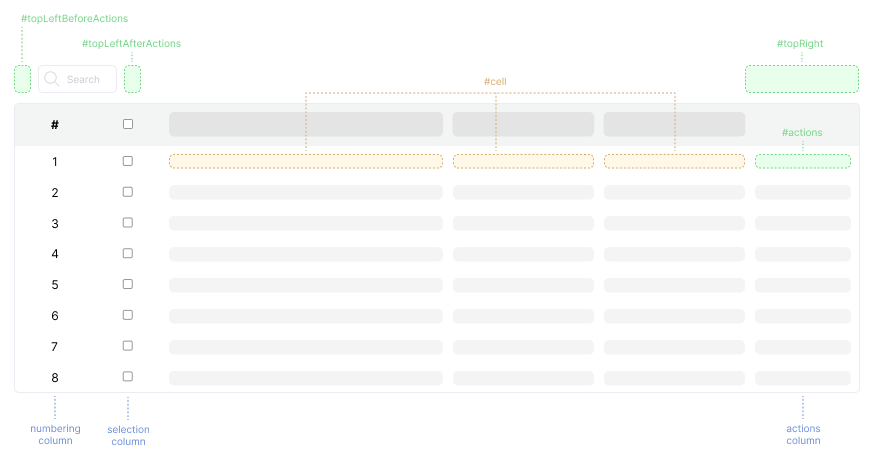

# Vue Datatables 182
Vue Datatables 182 is a component that provides a table with enhanced capabilities. This component supports:

- Searching
- Remote data
- Pagination
- Customizing with slots

## Get started

Install:
```bash
npm i vue-datatables-182
```

In main Vue file:
```js
import { DataTable, DataTableColumn } from 'vue-datatables-182'
import "vue-datatables-182/dist/style.css"

Vue.component('data-table', DataTable)
Vue.component('data-table-column', DataTableColumn)
```

Or in another Vue component;
```vue
<script lang="js">
import { DataTable, DataTableColumn } from 'vue-datatables-182'
import "vue-datatables-182/dist/style.css"

export default {
  name: 'SomeComponent',
  components: { DataTable, DataTableColumn },
  data() {
    return {
      items: [
        { name: 'New-York', order: 1 },
        { name: 'Moscow', order: 2 },
        { name: 'London', order: 3 },
        { name: 'Paris', order: 4 },
        { name: 'Berlin', order: 5 },
      ],
    }
  },
}
</script>

<template>
  <!-- client data source -->
  <data-table
    data-source="client"
    :items="items"
    numbering
    row-selection
  >
    <data-table-column
      field="name"
      orderable
      searchable
      title="Name"
    />
    <data-table-column
      field="order"
      orderable
      text-align="center"
      title="Order"
      width="200px"
    />
  </data-table>

  <!-- server data source -->
  <data-table
    data-source="server"
    url="/example-table"
    numbering
    row-selection
  >
    <data-table-column
      field="name"
      orderable
      searchable
      title="Name"
    />
    <data-table-column
      field="order"
      orderable
      text-align="center"
      title="Order"
      width="200px"
    />
  </data-table>
</template>
```

## UI element highlight


## Props

### Table data

### `data-source`
Source of data for the table. Available values: `client` and `server`.

```js
dataSource: {
  type: String,
  default: 'server',
}
```

### `url`
URL for fetching data when using a server-side data source.

```js
url: {
  type: String,
  default: null,
}
```

### `items`
Array of items for client-side data.

```js
items: {
  type: Array,
  default: () => [],
}
```

### Pagination

### `pagination`
Enables table pagination.

```js
pagination: {
  type: Boolean,
  default: true,
}
```

### `rowsPerPageOptions`
Number of rows per page.

```js
rowsPerPageOptions: {
  type: Array,
  default: () => [5, 10, 25, 50, 100],
}
```

### `rowsPerPageCount`
Number of rows per page. The value must be present in the rowsPerPageOptions array.

```js
rowsPerPageCount: {
  type: Number,
  default: 10,
}
```

### Search

### `searching`
Enables the search functionality.

```js
searching: {
  type: Boolean,
  default: true,
}
```

### Order

### `orderBy`
Column by which the data is ordered.

```js
orderBy: {
  type: String,
  default: null,
}
```

### `orderDirection`
Direction of ordering (ascending or descending). Available values: `asc` and `desc`.

```js
orderDirection: {
  type: String,
  default: 'asc',
}
```

### Fixed Columns

### `scrollX`
Enables horizontal scrolling for the table.

```js
scrollX: {
  type: Boolean,
  default: false,
}
```

### `fixedColumnsStart`
Number of columns fixed at the start of the table.

```js
fixedColumnsStart: {
  type: Number,
  default: 0,
}
```

### `fixedColumnsEnd`
Number of columns fixed at the end of the table.

```js
fixedColumnsEnd: {
  type: Number,
  default: 0,
}
```

### Other

### `rowSelection`
Enables row selection functionality.

```js
rowSelection: {
  type: Boolean,
  default: false,
}
```

### `actions`
Enables actions column.

```js
actions: {
  type: Boolean,
  default: false,
}
```

### `numbering`
Enables numbering for rows

```js
numbering: {
  type: Boolean,
  default: false,
}
```

### `rowsClickable`
Enables clickable rows.

```js
rowsClickable: {
  type: Boolean,
  default: false,
}
```

## Events

### `click:row`
Triggered when a row is clicked and the `rowsClickable` prop is `true`. 
The event passed to the handler contains the clicked row data.

#### Handler
```js
const handleClickRow = (row) => {
  // to do smth.
}
```

#### Table
```vue
<data-table
  data-source="client"
  :items="items"
  rows-clickable
  @click:row="handleClickRow"
>
```

### `update:selected-rows`
Triggered when the selected rows array changes. 
The event passed to the handler contains the updated selected rows array. The `rowSelection` prop must be set to `true`.

#### Handler
```js
const handleUpdateSelectedRows = (rows) => {
  // to do smth.
}
```

#### Table
```vue
<data-table
  data-source="client"
  :items="items"
  row-selection
  @update:selected-rows="handleUpdateSelectedRows"
>
```

## Slots

### `topLeftBeforeActions`
This slot is used to display content on the left side above the table, to the left of the search field.

```vue
<template #topLeftBeforeActions>
  <div>Content here</div>
</template>
```

### `topLeftAfterActions`
This slot is used to display content on the left side above the table, to the right of the search field.

```vue
<template #topLeftAfterActions>
  <div>Content here</div>
</template>
```

### `topRight`
This slot is used to display content on the right side above the table.

```vue
<template #topRight>
  <div>Content here</div>
</template>
```

### `actions`
This slot is used to display content in the action column cells. The slot provides the row's value.

*___Note:___ `@click.stop` is necessary to prevent the row click event.*

```vue
<template #actions="{ row }">
  <div @click.stop>
    <div>Actions for row #{{ row.number }}:</div>
    <button id="delete" :data-id="row.item.id"></button>
  </div>
</template>
```

### `cell`
This slot is used to display content in the custom column cells. The slot provides the row's value.

```vue
<data-table-column
  field="name"
  orderable
  searchable
  title="Name"
>
  <template #cell="{ row }">
    <div>
      <div>This is row #{{ row.number }}</div>
      <div>Title: {{ row.item.title }}</div>
    </div>
  </template>
</data-table-column>
```

[//]: # (todo: types of DataTable, exposed methods)
[//]: # (todo: row value description)