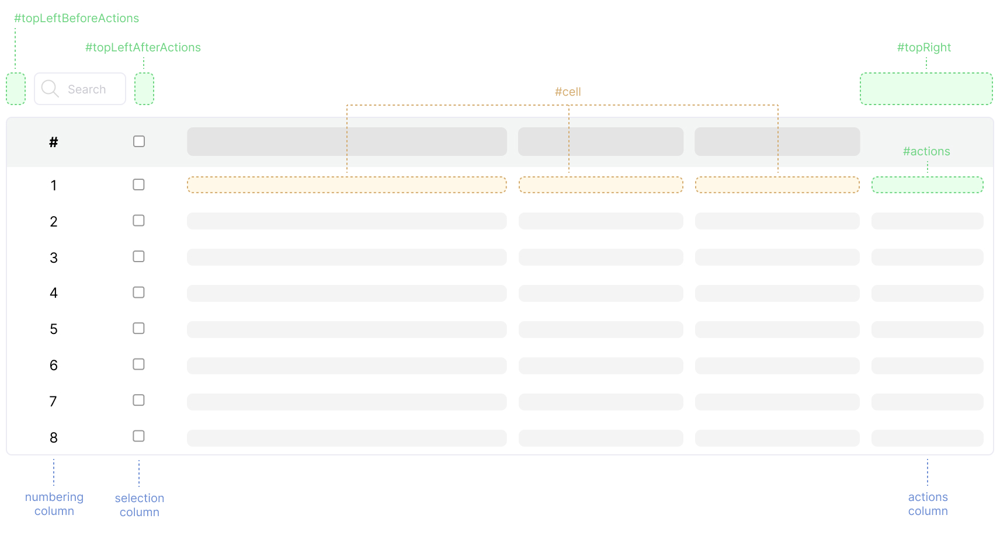

# Vue Datatables 182
Vue Datatables 182 — это компонент для отображения таблиц с расширенными возможностями.
Компонент поддерживает следующие возможности:

- Поиск
- Пагинацию
- Получение данных с сервера
- Настройку с помощью слотов

## Начало работы

#### Добавление реестра
```bash
echo @libs:registry=https://gitlab.corp/api/v4/packages/npm/ >> .npmrc
```

#### Установка пакета
```bash
npm i @libs/vue-datatables-182
```

#### Использование
В основном файле:
```js
import { DataTable, DataTableColumn } from 'vue-datatables-182'
import "vue-datatables-182/dist/index.css"

Vue.component('data-table', DataTable)
Vue.component('data-table-column', DataTableColumn)
```

Или в любом другом файле компонента:
```vue
<script lang="js">
import { DataTable, DataTableColumn } from 'vue-datatables-182'
import "vue-datatables-182/dist/index.css"

export default {
  name: 'SomeComponent',
  components: { DataTable, DataTableColumn },
  data() {
    return {
      items: [
        { name: 'New-York', order: 1 },
        { name: 'Moscow', order: 2 },
        { name: 'London', order: 3 },
        { name: 'Paris', order: 4 },
        { name: 'Berlin', order: 5 },
      ],
    }
  },
}
</script>

<template>
  <!-- данные из массива -->
  <data-table
    source="local"
    :items="items"
    numbering
    row-selection
  >
    <data-table-column
      field="name"
      orderable
      searchable
      title="Name"
    />
    <data-table-column
      field="order"
      orderable
      text-align="center"
      title="Order"
      width="200px"
    />
  </data-table>

  <!-- данные с сервера -->
  <data-table
    source="remote"
    url="/example-table"
    numbering
    row-selection
  >
    <data-table-column
      field="name"
      orderable
      searchable
      title="Name"
    />
    <data-table-column
      field="order"
      orderable
      text-align="center"
      title="Order"
      width="200px"
    />
  </data-table>
</template>
```

___

## Структура таблицы


___

## DataTable
### Props

#### Данные

#### `source`
Источник данных. Допустимые значения: `local` и `remote`.

```js
source: {
  type: String,
  default: 'remote'
}
```

#### `url`
URL для загрузки данных. Использовать только с `source="remote"`.

```js
url: {
  type: String,
  default: null
}
```

#### `items`
Массив данных для отображения. Использовать только с `source="local"`.

```js
items: {
  type: Array,
  default: () => []
}
```

#### Пагинация

#### `pagination`
Включает пагинацию таблицы.

```js
pagination: {
  type: Boolean,
  default: true
}
```

#### `rowsPerPageOptions`
Элементы списка выбора количества строк на странице.

```js
rowsPerPageOptions: {
  type: Array,
  default: () => [5, 10, 25, 50, 100]
}
```

#### `rowsPerPageCount`
Количество строк на странице. Значение должно присутствовать в массиве `rowsPerPageOptions`.

```js
rowsPerPageCount: {
  type: Number,
  default: 10
}
```

#### Поиск

#### `searching`
Включает поиск.

```js
searching: {
  type: Boolean,
  default: true
}
```

#### Сортировка

#### `orderBy`
Наименование столбца, по которому данные будут отсортированы по умолачанию.

```js
orderBy: {
  type: String,
  default: null
}
```

#### `orderDirection`
Порядок сортировки по умолчанию. Допустимые значения: `asc` и `desc`.

```js
orderDirection: {
  type: String,
  default: 'asc'
}
```

#### Закрепление столбцов

#### `scrollX`
Включает горизонтальную прокрутку таблицы.

```js
scrollX: {
  type: Boolean,
  default: false
}
```

#### `fixedColumnsStart`
Количество закрепленных столбцов с левого края.

*___Примечание:___ работает только если разрешена горизонтальная прокрутка. 
Рекомендуется указать фиксированную ширину для закрепленных столбцов.*

```js
fixedColumnsStart: {
  type: Number,
  default: 0
}
```

#### `fixedColumnsEnd`
Количество закрепленных столбцов с правого края.

*___Примечание:___ работает только если разрешена горизонтальная прокрутка. 
Рекомендуется указать фиксированную ширину для закрепленных столбцов.*

```js
fixedColumnsEnd: {
  type: Number,
  default: 0
}
```

#### Общие параметры

#### `rowSelection`
Добавляет столбец с чек-боксами для выделения строк.

```js
rowSelection: {
  type: Boolean,
  default: false
}
```

#### `actions`
Добавляет столбец с действиями.

*___Примечание:___ содержимое ячеек столбца необходимо добавить с помощью слота `actions`.*

```js
actions: {
  type: Boolean,
  default: false
}
```

#### `numbering`
Добавляет столбец с нумерацией строк.

```js
numbering: {
  type: Boolean,
  default: false
}
```

#### `rowsClickable`
Позволяет использовать событие клика строки. 

```js
rowsClickable: {
  type: Boolean,
  default: false
}
```

### Events

#### `row-click`
Событие срабатывает при клике строки, если пропс `rowsClickable` равен `true`. 
Событие, переданное обработчику, содержит данные строки.

##### script
```vue
<script lang="js">
export default {
  name: 'SomeComponent',
  methods: {
    handleClickRow(row) {
      // to do smth.
    }
  }
}
</script>
```

##### template
```vue
<data-table
  source="local"
  :items="items"
  rows-clickable
  @row-click="handleClickRow"
>
```

#### `update:selected-rows`
Событие срабатывает при выборе/отмене выбора строки.
Событие, переданное обработчику, содержит массив выбранных строк.
Пропс `rowSelection` должен быть равен `true`.

##### script
```vue
<script lang="js">
export default {
  name: 'SomeComponent',
  methods: {
    handleUpdateSelectedRows(rows) {
      // to do smth.
    }
  }
}
</script>
```

##### template
```vue
<data-table
  source="local"
  :items="items"
  row-selection
  @update:selected-rows="handleUpdateSelectedRows"
>
```

### Slots

#### `topLeftBeforeActions`
Этот слот используется для отображения содержимого слева сверху от таблицы, слева от поля поиска.
```vue
<data-table ... >
  <template #topLeftBeforeActions>
    <div>Content here</div>
  </template>
</data-table>
```

#### `topLeftAfterActions`
Этот слот используется для отображения содержимого слева сверху от таблицы, справа от поля поиска.
```vue
<data-table ... >
  <template #topLeftAfterActions>
    <div>Content here</div>
  </template>
</data-table>
```

#### `topRight`
Этот слот используется для отображения содержимого справа сверху от таблицы.
```vue
<data-table ... >
  <template #topRight>
    <div>Content here</div>
  </template>
</data-table>
```

#### `actions`
Этот слот используется для отображения содержимого в ячейках столбца действий. Слот предоставляет значение строки.

*___Примечание:___ событие с директивой `@click.stop` необходимо для предотвращения события клика строки.*

```vue
<data-table-column ... >
  <template #actions="row">
    <div @click.stop>
      <div>Actions for row #{{ row.number }}:</div>
      <button id="delete" :data-id="row.item.id"></button>
    </div>
  </template>
</data-table-column>
```

___

## DataTableColumn

### Props

#### `field`
Название свойства, значение которого будет отображено в ячейках данного столбца.

```js
field: {
  type: String,
  required: true
}
```

#### `title`
Заголовок столбца.

```js
title: {
  type: String,
  required: true
}
```

#### `orderable`
Разрешить сортировку строк по данному столбцу.

```js
orderable: {
  type: Boolean,
  default: false
}
```

#### `searchable`
Разрешить поиск по данному столбцу.

```js
searchable: {
  type: Boolean,
  default: false
}
```

#### `width`
Фиксированная ширина столбца. Необходимо указывать валидные CSS-значения свойства `width`.
Например, `width="120px"`. 

**Чтобы значение этого пропса устанавливала точное значение ширины столбца:**  
1. Хотя бы у одного из столбцов не должна быть указана ширина;
2. Должна быть разрешена горизонтальная прокрутка таблицы,
сумма ширины всех столбцов должна быть больше ширины таблицы.

```js
width: {
  type: String, 
  required: false,
  default: undefined
}
```

#### `textAlign`
Выравнивание текста в столбце таблицы. Доступные значения: `left`, `right` и `center`.

*___Примечание:___ если отображение содержимого ячеек столбца задается с помощью слота, 
это свойство может не иметь ожидаемого эффекта.*

```js
textAlign: {
  type: String,
  default: undefined
}
```


### Slots

#### `cell`
Этот слот используется для отображения содержимого в пользовательских ячейках столбца. 
Слот предоставляет значение строки.

```vue
<data-table-column
  field="name"
  orderable
  searchable
  title="Name"
>
  <template #cell="row">
    <div>
      <div>This is row #{{ row.number }}</div>
      <div>Title: {{ row.item.title }}</div>
    </div>
  </template>
</data-table-column>
```